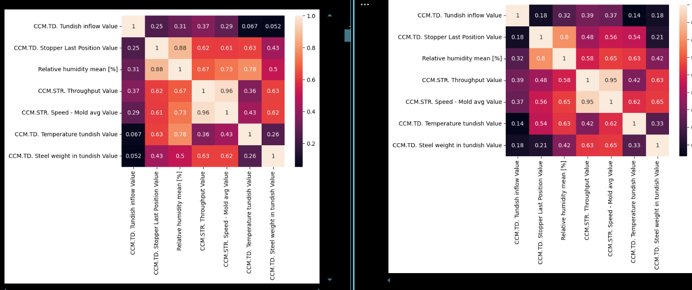

df_single[['CCM.STR. Throughput Value', 'CCM.TD. Steel weight in tundish Value']].phik_matrix()

changes a lot between casts sometimes

separate dataframes to stopper and sentypes

169, 178, 181

Look at pouring problems 110 ->

Left phik matrix are the casts just before the SEN 1 is changed to SEN 2. You can see the higher correlations in humidity. 

comparing 112 (abnormal) to 121 (normaL

135 to 230

102, 106, 108, 109, 112, , 184, 185, 186, 190